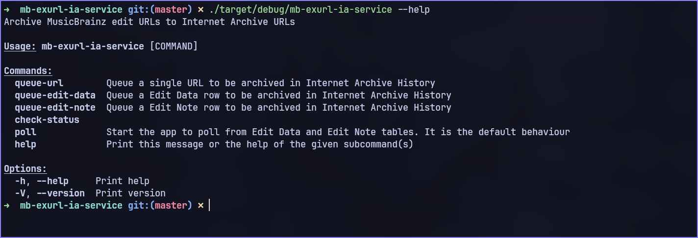

# MusicBrainz - External URLs - Internet Archive Service
(Sorry for such a long messy name, will update later ig)
- [Proposal Doc Link](https://docs.google.com/document/d/1Bk66_HFWEA6gBbFfQzIriGGgxxbEIwN1CbVDcz7FTys/edit?usp=sharing)

### Current Implementation (WIP)

We want to get URLs from `edit_data` and `edit_note` tables, and archive them in Internet Archive history.
The app provides multiple command line functionalities to archive URLs from `edit_data` and `edit_note` tables:


We create a `external_url_archiver` schema, under which we create the required table, functions, trigger to make the service work.

Following are the long-running tasks:

1. `poller task`
   - Create a `Poller` implementation which:
     - Gets the last `edit_note` id from `internet_archive_urls` table. We start polling the `edit_note` table from this id.
   - Poll `edit_note` table for URLs
   - Transformations to required format
   - Save output to `internet_archive_urls` table
2. `archival task`
   - Has 2 parts:
     1. `notifer`
         - Creates a `Notifier` implementation which:
           - Fetches the last unarchived URL row from `internet_archive_urls` table, and start notifying from this row id.
           - Initialises a postgres function `notify_archive_urls`, which takes the `start_id` integer value, from where we start notifying the channel in one go.
         - Reads `internet_archive_urls` table, and notifies the task which will save the URLS, through a channel called `archive_urls`.
     2. `listener`
         - Listens to the `archive_urls` channel, and makes the necessary Wayback Machine API request (The API calls are still to be made).

### See the app architecture [here](./docs/architecture.md)

### Local setup
> - Make sure musicbrainz db and the required database tables are present.
> - Follow https://github.com/metabrainz/musicbrainz-docker to install the required containers and db dumps.
> - Rename the `.env.example` to `.env`.
> - After ensuring musicbrainz_db is running on port 5432, Run the script `init_db.sh` in scripts dir.

There are 2 methods to run the program:
1. Build the project and run.
    - Make sure rust is installed.
   - ```shell
        cargo build &&
        ./target/debug/mb-exurl-ia-service
        ```
2. Use the Dockerfile
   - Note that the container has to run in the same network as musicbrainz db network bridge.
   1.  ```shell
       cargo sqlx prepare
       ```

   2. ```shell
      docker buildx build --build-arg PGHOST=musicbrainz-docker-db-1 -t mb-exurl-ia-service:latest .
      ```
   
   3. ```shell
      docker run -e PGHOST=musicbrainz-docker-db-1 --network musicbrainz-docker_default -it mb-exurl-ia-service:latest
      ```